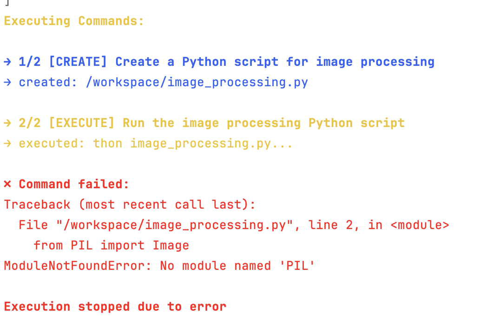

# Lab 3: Building an AI Software Engineer 

## ChatGPT (and one cool tool)
I used ChatGPT to plan out the steps for the lab, and then I mostly wrote the code myself.

Approximately ~80% (980 lines) of the code is written using ChatGPT. I generated a lot of the docker code (with a lot of special prompting to fit my environment), and some of the prompt manager code. I wrote the rest of the code, or used ChatGPT to refactor the starter code.

Regarding ChatGPT is one cool invention that I came up with, it's a tool that I call the "combiner", written in Swift and the GUI works exclusively in macOS. The URL is here: https://github.com/lilbillybiscuit/random-code/tree/main/combiner

Combiner comes in two parts, one is a command-line version and one is a native macOS GUI that launches and can be controlled entirely by keyboard shortcuts. The main idea is to parse through the directory of code files, and combine them into one file along with some sort of directory structure. The structure is as follows:

```
// file: main.swift
[code here]

// file: directory/file.swift
[code here]
```

It natively supports common languages, but can be extended to support any language (the only thing that really matters is the style of the comments). I did not include a readme in that link, but here are some quick instructions

**Command Line Version, built using Go**
```
go build combiner.go
./combiner --ext="py" | pbcopy
```
(the pbcopy copies the text directly to clipboard)

**macOS GUI Version, built using Swift**
```
swiftc combiner.swift
./main --ext=py
```

This will launch a GUI with all files with ".py" already selected. You can use keyboard shortcuts to navigate and select files, and then press enter to copy to clipboard, or escape to exit. The entire program launches in <0.2s on my M1 Max Macbook Pro and is super optimized.

Then, these can be pasted in to ChatGPT so that it is aware of the entire codebase, or relevant parts of it. I've found that this acheives **massive performance improvements**, and most of the code that ChatGPT (and Claude 3.5 Sonnet V2) wrote was context-aware, ready to use in my project.


And like the rest, 100% of combiner is written using Claude 3.5 Sonnet v2. We can sort of think of this like the "chicken-and-egg" problem in compilers, kind of. Without my manual prompting techniques, this tool would not exist. Without this tool, I would not have been able to write the code for this lab.
## To run the program
First build the docker image:
```
docker build -t coda .
```
Then run the program:
```
python main.py
```

## Part 2
Like part 1, in addition to the minimum requirements, I continued to focus on transparecy, reliability, security (graded), and scalability. I will talk about each of the points in detail.

### Transparency
Every step of the process is logged and prompted to the user. This means that we have to make sure that every step is "bite-sized", clear, and understandable. Therefore, each action is just "create", "append", "delete", and "execute", making it simple for the user to understand. I included some color cues and text formatting things to make the interface more appealing. You will need to run the program yourself, but here is a screenshot of the output:



Whenever a command needs to be executed, the user is prompted with a confirmation message, and the command is displayed in a clear and concise manner.

### Reliability
The system is designed to be reliable, with a lot of prompt engineering and robust error handling at every step. Since we are using docker to run the code, we can be sure that the code will run in a consistent environment. Furthermore, with a bit of prompt engineering, we have a very high probability of generating correct JSON files, and ChatGPT understands how to generate them and what they mean. Therefore, in my testing, I did not get any JSON parse errors, and all commands seemed intentional.

### Security
Security is a very important aspect of the system. First, we are running in a Docker container, which is only given access to a single folder on the host. While Docker breakout vulnerabilities can occur, this is a good balance between security and usability. Furthermore, the system is designed to be run in a controlled environment, and the user is prompted before any command is executed. This means that the user has full control over what commands are run, and can verify that they are correct. And since companies generally red-team their models to not produce malicious output, the security measures for the environment are relatively strong.

Now we also include some security measures when running commands. There is an allow list of commands that can be automatically run, and a list that requires user confirmation. This is to prevent any accidental or malicious commands from being run. Therefore, things like `rm -rf /` should be caught by the system and not run. Attempts to access sensitive files or directories will not be possible as the system is running in a Docker container with limited access.

If a command doesn't exist in the dictionary, the system automatically rejects it.

(I could have restricted the commands even further, but at some point it becomes no longer practical because an easy solution could be to generate a malicious file then run it innocently with python innocent_malicious.py)

### Scalability
The command system is designed to be scalable. The user can add as many commands as they want, and the system will automatically provide them as context to the AI, and automatically then execute said commands. To define one, it's as simple writing this somewhere in the code:

```python
@command("create", color="blue",
         required=["target", "content"],
         properties={
             "target": {
                 "type": "string",
                 "description": "Path where the file should be created",
                 "example": "path/to/new_file.txt"
             },
             "content": {
                 "type": "string",
                 "description": "Content to write to the file",
                 "example": "Hello, World!"
             },
             "mode": {
                 "type": "string",
                 "pattern": "^[0-7]{3,4}$",
                 "description": "File permissions in octal format (e.g., 755 for executable)",
                 "example": "644"
             },
             "in_container": {
                 "type": "boolean",
                 "description": "Whether to create the file inside the container",
                 "example": True
             }
         })
class CreateFileCommand(Command):
    """
    Create a new file with specified content and permissions.

    Example:
    {
        "action": "create",
        "target": "hello.py",
        "content": "print('Hello, World!')",
        "mode": "755",
        "in_container": true
    }
    """
    def execute(self, context: CommandContext) -> Dict[str, Any]:
        target_path = context.working_dir / self.data["target"]
        in_container = self.data.get("in_container", False)

        if context.dry_run:
            return {"status": "would create", "path": str(target_path)}

        try:
            if context.docker_env:
                # Create parent directory in container
                parent_dir = str(target_path.parent)
                context.docker_env.execute(f"mkdir -p {parent_dir}")

                # Copy content to file in container
                context.docker_env.copy_to_container(self.data["content"], str(target_path))

                # Set permissions if specified
                if "mode" in self.data:
                    context.docker_env.execute(f"chmod {self.data['mode']} {target_path}")
            else:
                # Local filesystem operations
                target_path.parent.mkdir(parents=True, exist_ok=True)
                target_path.write_text(self.data["content"])
                if "mode" in self.data:
                    target_path.chmod(int(self.data["mode"], 8))

            return {"status": "created", "path": str(target_path)}
        except Exception as e:
            raise ExecutionError(f"Failed to create file: {e}")


```

As many of these can be added as needed, and the system will automatically handle them.

My outputs are correct, the as before. My results are in the coda_output directory, organized into the following structure:
```
coda_output
├── 1_image_processing
│   ├── chat_history.json
│   ├── chat_log.txt
│   └── output.png
├── 2_markdown_html
│   ├── README.html
│   ├── chat_history.json
│   └── chat_log.txt
└── 3_status_checker
    ├── chat_history.json
    ├── chat_log.txt
    └── status_report.txt
```

## Performance Analysis

There are a few key metrics that are important to consider when evaluating the performance of the system.